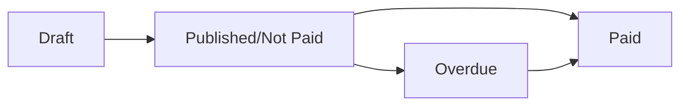

Modem Pay's invoice system provides a complete billing solution that goes beyond simple one-time payments. Whether you're charging for products, services, or managing recurring subscriptions, invoices give you the flexibility to create professional billing experiences for your customers.

## Why Use Invoices?

Invoices offer several advantages over traditional payment intents:

- **Professional Presentation** - Send branded, itemized bills to your customers
- **Flexible Payment Terms** - Set due dates and manage payment schedules
- **Subscription Ready** - Perfect for recurring billing without building complex subscription infrastructure
- **Automatic Follow-ups** - Built-in payment reminders and overdue tracking
- **Complete Audit Trail** - Track invoice lifecycle from creation to payment

## Invoice for Subscriptions

While Modem Pay will offer dedicated subscription management in the future, you can **use invoices today** to power your subscription business. Instead of managing complex payment intents and billing cycles yourself, simply create invoices for each billing period.

### How It Works

1. **Generate Invoices** - Create an invoice when a subscription payment is due
2. **Automatic Delivery** - Invoice is sent to your customer with a payment link
3. **Smart Tracking** - Monitor payment status and receive webhook events
4. **Overdue Management** - Automatically detect and handle late payments
5. **Retry Logic** - Send reminders to encourage payment completion

This approach gives you subscription-like functionality with minimal complexity, letting you focus on your product while Modem Pay handles the billing infrastructure.

## Invoice Types

Modem Pay supports two types of invoices to match your business needs:

### Simple Invoices
Perfect for straightforward billing with a single total amount. Ideal for:
- Service subscriptions (monthly SaaS fees)
- Membership dues
- Fixed-price offerings

```typescript
{
  amount: 5000,
  customer: "bd94e496-45f6-467d-8240-fd4cf204e6b1",
  due_date: "2025-12-31"
}
```

### Professional Invoices
Detailed invoices with itemized line items. Best for:
- Product-based subscriptions (monthly box services)
- Usage-based billing (API calls, storage, etc.)
- Multi-product purchases
- Transparent pricing breakdowns

```typescript
{
  amount: 5000,
  line_items: [
    { item: "Pro Plan", quantity: 1, unit_price: 3000 },
    { item: "Extra Users", quantity: 4, unit_price: 500 }
  ],
  discount: { type: "percentage", amount: 10 },
  customer: "bd94e496-45f6-467d-8240-fd4cf204e6b1"
}
```

## Invoice Lifecycle

Every invoice flows through a clear lifecycle:



- **Draft** - Invoice created but not sent to customer
- **Not Paid** - Invoice sent and awaiting payment
- **Paid** - Customer has completed payment
- **Overdue** - Due date passed without payment (production only)

## Key Features

### Automatic Overdue Detection
In production mode, Modem Pay automatically marks invoices as overdue when the due date passes without payment. You'll receive an `invoice.overdue` webhook event to trigger your business logic (pause service, send notices, etc.).

### Payment Reminders
Send automated reminders to customers with outstanding invoices. The system tracks reminder count to prevent spam.

### Callback URL
Use callback URLs with invoices to receive real-time event notifications, enabling you to automate actions such as updating subscription status or granting access when payment events occur.

## Currency Support

Currently, all invoices are denominated in **GMD (Gambian Dalasi)**. Multi-currency support is planned for future releases.

