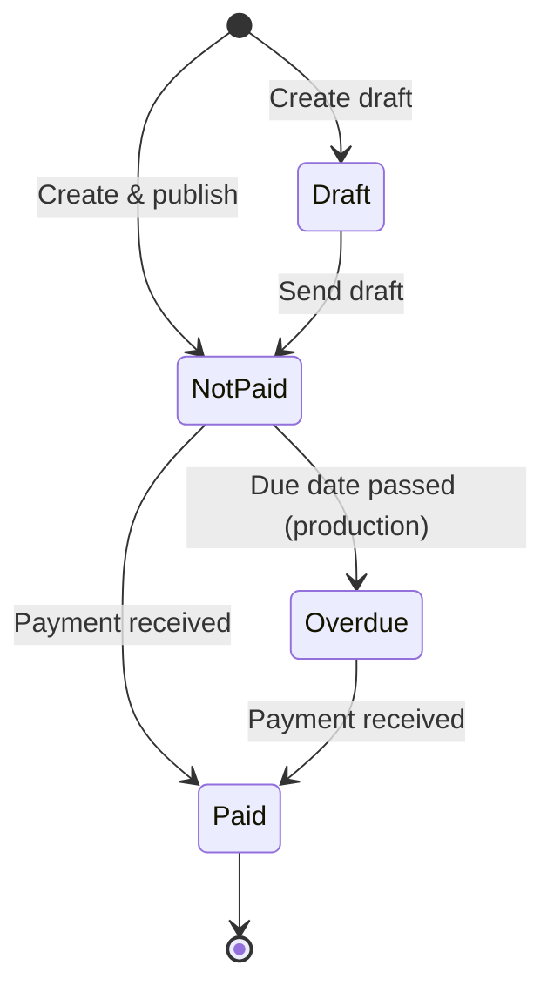

Every Modem Pay invoice exists in one of four states. Understanding these states is crucial for building reliable subscription and billing systems.



## The Four States

### 1. Draft
**Initial state for unpublished invoices**

An invoice in draft state has been created but not sent to the customer.

**Characteristics:**
- `status: draft`
- `sent_date: null`
- Customer has not been notified
- No payment link active
- Can be modified freely

**Use Cases:**
- Review invoices before sending
- Batch preparation of monthly invoices
- Approval workflows
- Price calculations that need verification

**Example:**

```typescript nodejs
const draft = await modempay.invoices.draft({
  amount: 5000,
  customer_email: "customer@example.com",
  customer_name: "Adama Jobe",
  due_date: "2025-12-31"
});

console.log(draft.sent_date); // null
// Customer has NOT received email
// Can still modify or delete
```

### 2. Not Paid (Published)
**Active invoice awaiting payment**

The invoice has been sent to the customer and is awaiting payment.

**Characteristics:**
- `status: "not-paid"`
- `sent_date: <ISO timestamp>`
- `paid_date: null`
- Customer has received email notification
- Payment link is active
- Can still be updated (with caution)

**Use Cases:**
- Standard invoice flow
- Active subscription billing
- Pending payments
- Awaiting customer action

**Example:**

```typescript nodejs
// Creating directly publishes
const invoice = await modempay.invoices.create({
  amount: 2500,
  customer_email: "customer@example.com",
  customer_name: "Adama Jobe",
  due_date: "2025-12-31"
});

console.log(invoice.status); // "not-paid"
console.log(invoice.sent_date); // "2025-11-24T10:30:00Z"
// Customer receives email immediately

// Or publish a draft
await modempay.invoices.sendDraftInvoice(draft.id);
```

**Monitoring:**

```typescript nodejs
// Check if still unpaid
const invoice = await modempay.invoices.retrieve(id);

if (invoice.status === "not-paid") {
  const daysSinceSent = getDaysSince(invoice.last_reminded??invoice.sent_date);
  
  if (daysSinceSent > 7) {
    // Send reminder
    await modempay.invoices.sendReminder(invoice.id);
  }
}
```

### 3. Paid
**Invoice successfully paid**

Payment has been received and confirmed.

**Characteristics:**
- `status: "paid"`
- `paid_date: <ISO timestamp>`
- Payment link no longer accepts payments
- Final state (cannot transition back)
- Triggers `paymentrequest.success` webhook event

**Use Cases:**
- Successful subscription payment
- Grant service access
- Generate receipt
- Update billing records
- Provision resources

**Example:**

```typescript
// Automatic when customer pays via link
// Or manual for offline payments
await modempay.invoices.pay(invoice.id);

// Retrieve to confirm
const paid = await modempay.invoices.retrieve(invoice.id);
console.log(paid.status); // "paid"
console.log(paid.paid_date); // "2025-11-24T14:22:00Z"
```

**Webhook Handling:**

```typescript
// In your webhook endpoint
if (event.event === 'paymentrequest.success') {
  const invoice = event.payload;
  
  // Grant subscription access
  await activateSubscription(invoice.customer);
  
  // Send receipt
  await sendReceiptEmail(invoice);
  
  // Update internal records
  await recordPayment(invoice);
}
```

### 4. Overdue
**Payment deadline passed without payment**

The due date has passed and the invoice remains unpaid (production mode only).

**Characteristics:**
- `status: "overdue"`
- `paid_date: null`
- Due date has passed
- Only in production mode (not test mode)
- Automatically set at midnight on due date
- Triggers `invoice.overdue` webhook event
- Can still transition to paid

**Use Cases:**
- Subscription payment failures
- Grace period enforcement
- Service suspension
- Collections process
- Dunning management

**Example:**

```typescript
// Automatic on due date in production
// If invoice created on Nov 1 with due_date Nov 30
// On Dec 1 at midnight: status becomes "overdue"

// Handle overdue webhook
if (event.event === 'invoice.overdue') {
  const invoice = event.payload;
  
  // Implement your policy
  await suspendSubscription(invoice.customer);
  await sendOverdueNotice(invoice);
  
  // Grace period: send reminders for 7 days
  await scheduleReminders(invoice, 7);
}
```

<Warning>
**Production Only:** Overdue detection only works with live API keys (`sk_live_`). Test invoices never become overdue, allowing safe testing without time constraints.
</Warning>

## State Transitions

### Creating Invoices

**Direct Creation (Published):**
```typescript nodejs
// Goes directly to "not-paid"
const invoice = await modempay.invoices.create({
  amount: 2500,
  customer_email: "customer@example.com",
  customer_name: "Adama Jobe"
});
// Status: "not-paid", customer receives email
```

**Draft Creation:**
```typescript nodejs
// Starts in draft state
const draft = await modempay.invoices.draft({
  amount: 2500,
  customer_email: "customer@example.com",
  customer_name: "Adama Jobe"
});
// State: draft, customer does NOT receive email
```

### Publishing Drafts

```typescript nodejs
// Draft → Not Paid
await modempay.invoices.sendDraftInvoice(draft.id);
// Now: Status: "not-paid", customer receives email
```

### Payment

```typescript nodejs
// Not Paid → Paid (customer pays online)
// Happens automatically via payment link

// Or manually mark as paid (for offline payments)
await modempay.invoices.pay(invoice.id);
// Status: "paid", webhook triggered
```

### Overdue Detection

```typescript nodejs
// Not Paid → Overdue (automatic in production)
// Happens at midnight on due_date if still unpaid
// invoice.overdue webhook is sent

// Overdue → Paid (customer finally pays)
// Still possible to pay overdue invoices
```

## Timeline Example

Here's a complete subscription invoice lifecycle:

```
Day 1 (Nov 1):
  └─ Draft created for December billing
     State: draft, sent_date: null

Day 5 (Nov 5):
  └─ Review complete, draft published
     Status: "not-paid", sent_date: Nov 5
     → Customer receives email with payment link

Day 12 (Nov 12):
  └─ No payment yet, send reminder
     reminder_count: 1

Day 20 (Nov 20):
  └─ Customer pays via link
     Status: "paid", paid_date: Nov 20
     → paymentrequest.success webhook sent
     → Subscription access granted

Alternative Timeline (Payment Failure):

Day 1-20: Same as above

Day 30 (Nov 30):
  └─ Due date reached, still unpaid

Day 31 (Dec 1, midnight):
  └─ Automatic overdue detection (production)
     Status: "overdue"
     → invoice.overdue webhook sent
     → Subscription suspended
     → Overdue notice sent to customer

Day 35 (Dec 5):
  └─ Customer pays after overdue notice
     Status: "paid", paid_date: Dec 5
     → paymentrequest.success webhook sent
     → Subscription reactivated
```

## Working with Invoice States

### Checking Current State

```typescript nodejs
async function getInvoiceState(id: string) {
  const invoice = await modempay.invoices.retrieve(id);
  
  return {
    status: invoice.status,
    isPaid: invoice.status === "paid",
    isOverdue: invoice.status === "overdue",
    isAwaitingPayment: invoice.status === "not-paid",
    daysSinceSent: invoice.sent_date 
      ? getDaysSince(invoice.sent_date) 
      : null,
    daysUntilDue: invoice.due_date 
      ? getDaysUntil(invoice.due_date) 
      : null
  };
}
```

### State-Based Business Logic

```typescript nodejs
async function handleInvoiceStatus(invoice: Invoice) {
  switch (invoice.status) {
    case "not-paid":
      // Check if reminder needed
      if (shouldSendReminder(invoice)) {
        await modempay.invoices.sendReminder(invoice.id);
      }
      break;
      
    case "paid":
      // Grant access
      await activateSubscription(invoice.customer);
      break;
      
    case "overdue":
      // Suspend service
      await suspendSubscription(invoice.customer);
      
      // Start dunning process
      await startDunningCampaign(invoice);
      break;
  }
}
```

### Subscription State Management

```typescript nodejs
async function syncSubscriptionWithInvoice(
  subscription: Subscription,
  invoice: Invoice
) {
  if (invoice.status === "paid") {
    // Extend subscription
    subscription.status = "active";
    subscription.current_period_end = addMonths(
      subscription.current_period_end, 
      1
    );
    
  } else if (invoice.status === "overdue") {
    // Grace period logic
    const daysOverdue = getDaysSince(invoice.due_date);
    
    if (daysOverdue > 7) {
      subscription.status = "suspended";
    } else {
      subscription.status = "past_due"; // Grace period
    }
  }
  
  await subscription.save();
}
```

## Important Timestamps

Invoices track several key timestamps:

| Field | Description | Example |
|-------|-------------|---------|
| `createdAt` | When invoice was first created | "2025-11-01T10:00:00Z" |
| `updatedAt` | Last modification time | "2025-11-05T14:30:00Z" |
| `sent_date` | When invoice was sent to customer | "2025-11-05T14:30:00Z" |
| `due_date` | Payment deadline | "2025-11-30" (date only) |
| `paid_date` | When payment was received | "2025-11-20T16:45:00Z" |

```typescript nodejs
const invoice = await modempay.invoices.retrieve(id);

// Calculate metrics
const createdToPaid = getDuration(invoice.createdAt, invoice.paid_date);
const sentToPaid = getDuration(invoice.sent_date, invoice.paid_date);
const wasOverdue = new Date(invoice.paid_date) > new Date(invoice.due_date);
```

## Test Mode vs Production

### Test Mode Behavior

```typescript nodejs
// Using test API key (sk_test_...)
const testInvoice = await modempay.invoices.create({
  amount: 5000,
  customer_email: "test@example.com",
  customer_name: "Adama Jobe",
  due_date: "2024-01-01" // Past date
});

console.log(testInvoice.test_mode); // true
console.log(testInvoice.status); // "not-paid"
// Never becomes "overdue" even if due date passed
```

### Production Mode Behavior

```typescript nodejs
// Using live API key (sk_live_...)
const liveInvoice = await modempay.invoices.create({
  amount: 5000,
  customer_email: "customer@example.com",
  customer_name: "Adama Jobe",
  due_date: "2025-11-30"
});

console.log(liveInvoice.test_mode); // false
// Will become "overdue" on Dec 1 if unpaid
// invoice.overdue webhook will be sent
```

## Best Practices

<AccordionGroup>
  <Accordion title="Always Use Webhooks for Status Changes">
    Don't poll for status changes. Implement webhook handlers for `paymentrequest.success` and `invoice.overdue` events for real-time updates.
  </Accordion>
  
  <Accordion title="Set Reasonable Due Dates">
    For subscriptions, set due dates 7-14 days after invoice creation to give customers time to pay. For monthly billing, due date should be before the next billing cycle.
  </Accordion>
  
  <Accordion title="Implement Grace Periods for Overdue">
    Don't immediately suspend services when invoices go overdue. Implement a 3-7 day grace period with automated reminders before taking action.
  </Accordion>
  
  <Accordion title="Use Drafts for Batch Processing">
    When generating invoices for many customers, create drafts first, review for accuracy, then publish in batches.
  </Accordion>
  
  <Accordion title="Track reminder_count">
    Monitor `reminder_count` to avoid spamming customers. Implement logic like: reminder at 7 days before due, at due date, and 3 days after due date.
  </Accordion>
  
  <Accordion title="Test Thoroughly in Test Mode">
    Test your entire flow in test mode before going live. Remember: test invoices never go overdue, so test overdue logic separately.
  </Accordion>
</AccordionGroup>

## Common Patterns

### Subscription Billing State Machine

```typescript nodejs
class SubscriptionInvoiceManager {
  async createMonthlyInvoice(subscription: Subscription) {
    // Create draft
    const draft = await modempay.invoices.draft({
      amount: subscription.plan.price,
      customer: subscription.customer_id,
      customer_email: subscription.customer_email,
      customer_name: subscription.customer_name,
      due_date: this.getNextDueDate(subscription),
      notes: `${subscription.plan.name} - ${this.getCurrentPeriod()}`
    });
    
    return draft;
  }
  
  async publishInvoice(id: string) {
    await modempay.invoices.sendDraftInvoice(id);
    // Status: not-paid, customer notified
  }
  
  async handlePaid(invoice: Invoice) {
    // Extend subscription
    await this.extendSubscription(invoice.customer);
  }
  
  async handleOverdue(invoice: Invoice) {
    // Grace period
    await this.startGracePeriod(invoice.customer);
    
    // Schedule follow-ups
    await this.scheduleDunning(invoice);
  }
}
```

